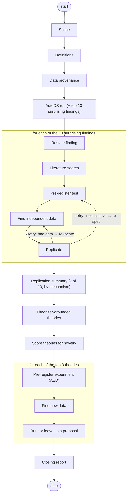

# Data-driven theory generation

Take an AutoDS run's most surprising findings, test whether each holds up on data the run didn't use, then build theory on what survives and run a follow-up experiment.

## Flow

## Nodes

| id | type | inputs | description | skills |
|---|---|---|---|---|
| `scope` | `scope` | — | Anchor the question on the AutoDS run named in `mission.md`. | — |
| `definitions` | `definitions` | `scope` | Pin down each term so it's testable against the data. | — |
| `data_provenance` | `evidence_gathering` | `definitions` | Load the `asta://` documents and dataset URIs from `mission.md` and index any local PDFs. Record which datasets the AutoDS run itself used — later steps need that to judge what counts as independent. | `asta-preview:local-paper-index` |
| `auto_discovery` | `auto_discovery` | `scope, data_provenance` | Import the `run_pointer:` run, or create one against the `datasets[]`. Export the full results to `artifacts/experiments_<runid>.json`, and list the 10 highest-surprise nodes — the findings to replicate. | `asta-preview:autodiscovery` |
| `hypothesis` | `hypothesis` | `auto_discovery` | For each of the 10: restate the node's finding as one claim to replicate, citing the node. | — |
| `literature_review` | `literature_review` | `hypothesis, data_provenance` | Search the literature for this finding with `asta-preview:find-literature` — start from the `data_provenance` documents, then go to PaperFinder. As you read, pull out the **datasets those papers used and where to get them** (repository, data DOI, availability statement) — these are the leads `evidence_gathering` fetches. The job isn't just context; it's to find real, independent data to re-test the finding. | `asta-preview:find-literature`, `asta-preview:asta-documents` |
| `experiment_design` | `experiment_design` | `hypothesis, literature_review` | Pre-register the replication test before any results: state the pass/fail rule — same sign and significant, or effect inside the original confidence interval. | — |
| `evidence_gathering` | `evidence_gathering` | `experiment_design, data_provenance` | Go get an external dataset to re-test the finding: follow `literature_review`'s leads to the public sources those papers used (repositories, data DOIs, availability statements) and **download** the most relevant one. This is the expected path — a test on the run's own inputs isn't independent, so don't settle for it. Log every attempt (found / downloaded / blocked) in `artifacts/acquisition_ledger.json`. Only once a documented search turns up nothing usable may you fall back to the run's own sources, marked the weakest tier. | — |
| `analysis` | `analysis` | `hypothesis, experiment_design, evidence_gathering` | Replicate in DataVoyager (`asta analyze-data submit`) against the pre-registered rule. The verdict must come from a run on real data, not the AutoDS export or your own reasoning. Record the tier: replicated on independent data / consistent within the run's own data (fallback) / not testable. No data, no close — leave it blocked. | `asta-preview:analyze-data` |
| `replication_synthesis` | `synthesis` | `analysis` (all 10) | Report how many of the 10 replicated, which failed, and which couldn't be tested — each with its tier. Group the findings into mechanisms for the report and the theorizer. | — |
| `theorizer_theories` | `hypothesis` | `scope, replication_synthesis` | Run the theorizer once (the question plus a statement of which findings replicated; see [example](../assets/theorizer_mission_example.md)). No `paper_store`; set `max_papers_to_retrieve: 100`. Keep only theories anchored to at least one replicated finding. Map theory→`statement`, anchoring findings→`rationale`, prediction→`falsifiable_prediction`. | `asta-preview:generate-theories` |
| `novelty` | `hypothesis` | `theorizer_theories` | Score the theories for novelty and re-emit them ranked. The follow-on tests the top 3 by novelty × feasibility. | `asta-preview:generate-theories` |
| `followon_exp_design` | `experiment_design` | `novelty` | For each of the top 3 theories: pre-register an experiment for it with the AutoExperimentDesigner (`asta auto-exp-designer design-experiment`), using the 5 most related papers. Not `asta-preview:experiment` — that runs Panda, a different system. | `asta auto-exp-designer` |
| `followon_evidence` | `evidence_gathering` | `followon_exp_design` | Go get genuinely new data for the experiment — fetch it from the public sources the related papers used, not a re-slice of the replication data. Log attempts in the ledger. If nothing usable exists, the pre-registered design is the deliverable — a proposal for future data. | — |
| `followon_analysis` | `analysis` | `followon_exp_design, followon_evidence` | If the new data exists, run the experiment in DataVoyager to a verdict and save figures, tables, and logs to `artifacts/`. If it doesn't, close it as untested — `inconclusive`, with a caveat that it's a pre-registered proposal, linking the design — rather than forcing a run or blocking the report. Retry (only when a run failed to actually test the theory) per the table below. | `asta-preview:analyze-data` |
| `report` | `synthesis` | `replication_synthesis, followon_analysis` (all 3) | Write `artifacts/report.tex` → PDF and a short `output.md`. Report the replication results and all three follow-on outcomes — tested (held or failed) or proposed (untested, no data). Read [`report_example.tex`](../assets/report_example.tex) in full first and match its depth and citation density. Embed every figure. `validate-output.sh` checks the report has the basics before it closes. | — |

The 10 finding-restatement `hypothesis` tasks are filled and closed at creation — see plan.md. (`theorizer_theories` and `novelty` are `hypothesis`-typed too, but they run a skill, so they execute like any other task.)

## Running DataVoyager

Both the per-finding `analysis` and `followon_analysis` run in DataVoyager — at most 3 at a time, attaching every dataset up front. A replication needs data the run didn't use, so go find and download it — the literature is your map to what's public. Combining the run's own sources is the weakest tier, allowed only after the acquisition ledger shows a real external search came up empty; "stayed local" is not a replication. Only call data `data_unavailable` once the ledger shows the trace failed — a 403/404 on someone else's resource isn't proof — then leave that `analysis` blocked, not closed.

A clean result against the pre-registered rule — replicated or not — is the verdict, not a reason to retry. Retry only when the run didn't actually test the claim:

| What DataVoyager did | Go back to | Fix |
|---|---|---|
| Couldn't load or join the data (`KeyError`, missing columns, mismatched keys, duplicate rows) | `evidence_gathering` (≤3) | Re-locate or pre-process. If a multi-file join keeps failing, pre-join into one or two master panels in a documented script and resubmit, recording the join rules in `provenance.json`. |
| Ran but was underpowered or inconclusive on its own terms | `experiment_design` (≤3) | Reconsider power or controls — but do not move the pre-registered bar to manufacture a pass. |
| Infra failure (kernel error, timeout, transcription glitch) | `analysis` (≤3) | Resubmit as-is. If it recurs, switch to the pre-joined master panels above. |

## mission.md

- `run_pointer:` — the AutoDS run to import (omit to create one).
- `datasets[]` — input dataset URIs for a new run.
- A focus statement in the body — the question under study.

Unless the user explicitly says to use local inputs only, fetch external public data for replication.

## Writing the report and outputs

These apply to every `output.md` and the final report — documents a domain expert will read, not work logs. `validate-output.sh` checks links and the report's structure automatically; the rest is on you.

- **Tone.** Neutral, for an expert in the field. No exclamations, no filler, no "we will now…".
- **Cite specifics.** Every non-trivial claim points to a paper, dataset, or experiment; effect sizes, p-values, and thresholds always cite the experiment that produced them. Number the computational experiments `E1, E2, …` and list each (finding → test → result → verdict) in an appendix.
- **Link what you name.** Every finding, paper, theory, dataset, run, and experiment is a real link, never bare text or `node_3_0`:

  | thing | link to |
  |---|---|
  | AutoDS node (`node_3_0`) | `artifacts/experiments_<runid>.json`, at the node id |
  | paper | the asta document, paper URL, or `data_provenance` entry |
  | theory | `artifacts/theorizer_result.json`, or the task that produced it |
  | DataVoyager run | `artifacts/dv_result*.json`, or the task that exported it |
  | dataset | the file under `inputs/`, or the Datasets appendix |
  | experiment E-number | its appendix entry |

- **Show figures.** Every figure an `analysis` produces is embedded in `output.md` and `\includegraphics`'d in the report, so the page stands alone.
- **Write about the science, not the workflow.** No task ids, "epic", or node names in the prose.
- **Be honest about what held up.** Report the replication rate and the tiers plainly — a finding that didn't replicate, or couldn't be tested on independent data, is a result, not a gap to paper over. Don't invent experiments beyond what was designed.
