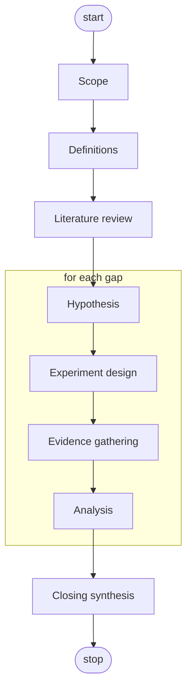

# Hypothesis-driven research

Survey the literature, raise a hypothesis for each gap, test each one, and write a closing report.

## Flow

## Nodes

| id | type | inputs | description | skills |
|---|---|---|---|---|
| `scope` | `scope` | — | One line: the question under study. | — |
| `definitions` | `definitions` | `scope` | Pin down each term so it's testable against data. | — |
| `lit_review` | `literature_review` | `scope, definitions` | Survey the literature with `asta literature interactive`. Emit `gaps[]` — one hypothesis per gap. | `asta-preview:find-literature` |
| `hypothesis` | `hypothesis` | `lit_review` | For each gap: turn it into a falsifiable hypothesis with a concrete prediction. | — |
| `experiment_design` | `experiment_design` | `hypothesis` | Design an experiment that could falsify the hypothesis. | — |
| `evidence_gathering` | `evidence_gathering` | `experiment_design` | Locate the data the design needs; note anything that diverged from it. | — |
| `analysis` | `analysis` | `hypothesis, experiment_design, evidence_gathering` | Get the verdict from DataVoyager (`asta analyze-data submit`), framed on the hypothesis with the gathered data. It must come from a run on real data, not your own reasoning. | `asta-preview:analyze-data` |
| `closing` | `synthesis` | `analysis` (all hypotheses) | Reconcile the verdicts into one answer to the question. | — |

The `hypothesis` tasks are filled and closed at creation from the literature gaps — see plan.md.
