# Template: autods-to-theorizer

AutoDS run → literature-grounded findings → focused cross-dataset replication → cross-cutting theorize → contextualized synthesis (always-`findings.md` closing artifact).

**When this template is used.** `plan.md` selects this template by reading `mission.md` prose and recognizing AutoDS-flavored intent — e.g., the mission mentions "AutoDS run …", references a UUID-shaped run id, points at a downloaded export directory, or describes a fresh autodiscovery configuration. No frontmatter is required on `mission.md`; the agent reads the prose to decide.

**Where the spec lives.** The Mermaid diagram below is the control-flow spec (task types, ordering, gates). The output schema for every new task type — including non-obvious gotchas (file paths, field names, decision thresholds, failure handling) — lives in `assets/schemas.yaml`. The three pieces of guidance below the diagram (theorize failure semantics, theorize query composition, and findings.md tone) don't fit naturally in either source.

```mermaid
flowchart TD
    %% Replan rules: each task close triggers creation of its successor(s) in the diagram.
    %% Standard edges (parent-child to epic, blocks from upstream) are implied.
    %% All `asta ...` calls should prefix `unset ASTA_GATEWAY_URL &&` (see init.md).

    %% ════ Bootstrap (plan.md reads mission.md prose to pick this template) ════
    mission[/"mission.md"/]:::data --> scope[scope]:::task
    scope --> defs[definitions]:::task

    %% ════ AutoDS — sourcing the run ════
    defs --> autods[autods_run]:::new
    autods --> aMode{resolve source<br/>from mission.md prose}:::decision
    aMode -->|run id found| aImport[asta autodiscovery<br/>experiments]:::action
    aMode -->|local export<br/>path found| aLocal[parse local export<br/>mcts_nodes_all.json + metadata]:::action
    aMode -->|fresh-run intent| aExec[asta autodiscovery<br/>create / upload / submit;<br/>block to SUCCEEDED]:::action
    aMode -.->|ambiguous /<br/>silent| aAsk[/"ask user:<br/>which source?"/]:::usergate
    aAsk -.-> aMode

    %% ════ Literature ════
    aImport --> prov[literature_review<br/>provenance]:::task
    aLocal --> prov
    aExec --> prov
    prov --> themeCluster[cluster hypotheses<br/>into 3-6 themes]:::action
    themeCluster --> themes[literature_review × N<br/>per theme; parallel]:::task
    themes --> litsyn[autods_literature_synthesis]:::new

    %% ════ Post-lit gates ════
    %% surviving_findings filter: see schemas.yaml autods_literature_synthesis.surviving_findings comment.
    litsyn --> qSurv{all surprisals<br/>filtered as known?}:::decision
    litsyn --> qLitContra{any AutoDS finding<br/>contradicted by lit?}:::decision

    qSurv -->|yes| askDS[/"ask user:<br/>provide replication dataset<br/>or skip?"/]:::usergate
    askDS -->|provide| updMis[update mission.md:<br/>replication_dataset_path]:::action
    askDS -->|skip| syn
    qSurv -->|no| repro

    qLitContra -->|yes| hrContra[/"human_review:<br/>contradicted findings"/]:::usergate
    qLitContra -->|no| repro
    hrContra -->|blocks| repro

    updMis --> repro

    %% ════ Replication ════
    repro[replication]:::new

    %% ════ Post-replication gate ════
    %% Confidence anchors + threshold rationale: see schemas.yaml replication.findings[].confidence.
    repro --> qFailed{any failed_to_replicate<br/>with confidence > 0.7?}:::decision
    qFailed -->|yes| hrFailed[/"human_review:<br/>failed replications"/]:::usergate
    qFailed -->|no| theo
    hrFailed -->|blocks| theo

    %% ════ Theorize ════
    %% CLI flags, context-window contract, artifacts export: see schemas.yaml `theorize`
    %% task-type comment. Query-composition template: see below.
    %% No agent-side fallback. If generate-theories does not return theories, the task and
    %% the epic are marked status=failed and the run stops for human review.
    theo[theorize]:::new
    theo --> qTheoOk{generate-theories<br/>returned theories?}:::decision
    qTheoOk -->|yes| syn
    qTheoOk -->|no| theoFail[bd update theorize-id --status=failed<br/>bd update epic-id --status=failed<br/>STOP for human review]:::action

    %% ════ Synthesis (ALWAYS runs — closing artifact on every path) ════
    %% Universal closing task. Theory-centric for autods flows: leads with the
    %% theories generated by the upstream `theorize` task, contextualized with
    %% the surviving AutoDS patterns and replication evidence. Schema is the
    %% generic `synthesis` (see schemas.yaml); tone + outline guidance below.
    syn[synthesis]:::new
    syn --> closeOk(("close epic")):::terminal
    syn -.->|V2 only:<br/>open_questions AND<br/>discovery_loop| askDisc[/"ask user:<br/>spawn sub-epics?"/]:::usergate
    askDisc -.->|select| spawn[spawn_subepic × K]:::action
    askDisc -.->|decline| closeOk

    classDef task fill:#e1f5ff,stroke:#0288d1,color:#0c1024
    classDef new fill:#fff4e1,stroke:#d97706,color:#0c1024
    classDef decision fill:#fff9c4,stroke:#f9a825,color:#0c1024
    classDef usergate fill:#ffccbc,stroke:#d84315,color:#0c1024
    classDef action fill:#f0f4c3,stroke:#9e9d24,color:#0c1024
    classDef terminal fill:#e0e0e0,stroke:#616161,color:#0c1024
    classDef data fill:#ecfccb,stroke:#3f6212,color:#0c1024
```



## Task creation: titles and descriptions

Every task this template spawns gets both a `--title` and `--description` on
`bd create`, written per `SKILL.md §"Voice for titles and descriptions"`.
Read that section before creating tasks; the rules apply unchanged. As a
sanity-check, here are the titles this template should produce on a typical
run — read them top-to-bottom and they should sound like a paragraph
narrating the workflow:

Each title names the **specific subject** of the step, not just the task
type. "Define the geometry terms" is too generic; "Define snowline, shape,
and timing terms" tells the reader which terms.

| task_type | example title (imperative, names the subject, ≤ 6 words) |
|---|---|
| `scope` | "Frame Alaska glacier shape-vs-snowline question" |
| `definitions` | "Define snowline, shape, and timing terms" |
| `autods_run` | "Import 51 AutoDS-flagged glacier patterns" |
| `literature_review` (provenance) | "Find source papers for both datasets" |
| `literature_review` (theme A) | "Search literature on observed-vs-predicted snowline" |
| `literature_review` (theme B) | "Search literature on shape-based AAR predictors" |
| `literature_review` (theme C) | "Search literature on regional volume-area scaling" |
| `literature_review` (theme D) | "Search literature on off-glacier subpopulations" |
| `autods_literature_synthesis` | "Pick patterns literature can't explain" |
| `replication` | "Re-run surviving patterns on different year" |
| `theorize` | "Propose theories linking surviving glacier patterns" |
| `synthesis` (closing) | "Write closing report on the theories" |

Bad titles this template *will* drift toward if you let it (do not write
these — `SKILL.md` enumerates the full ban list):
`scope: research question, boundaries, and success criteria for ...`,
`literature_review: theme A — observed-vs-hypsometric ELA discrepancy (6 surprises)`,
`synthesis: findings.md — closing artifact for run 9fc65db8`.

## Replication: faithful-attempt requirement

`replication` is the load-bearing empirical step — don't short-circuit it.
"Replication" here = re-test the surviving finding on a *different* cut of
the data (different year, different dataset, different join), per the NSF /
NASEM "replicability" definition. Not same-data-same-analysis reproduction.

Before marking any candidate dataset `failed` or any finding `inconclusive` /
`unreachable`, walk this list and record the URL you tried for each:

1. The source paper's data-availability statement (this is the first move,
   not the last — Copernicus, Cambridge, AGU, EGU, Nature DASes almost always
   name a stable repository DOI).
2. Zenodo, USGS ScienceBase, PANGAEA, ETH Research Collection, NSIDC.
3. Author / lab GitHub (committed data or release assets; check LFS).
4. Publisher supplementary materials.

`fetch_status: failed` requires URL + one-line failure reason in `rationale`
or `deviations[]`. "I didn't try" is not "I tried and failed."

Each per-finding `.asta/replication/<slug>/<node_id>/` must contain a
runnable `replicate.py`, its input data, figures, a `log.md` of captured
numbers, and an `assessment.md` whose claims cite the script. A directory
with only `assessment.md` is not a valid replication — leave the task
`in_progress` and come back.

**Anti-patterns that block close:** prose like "would test", "could be done",
"deferred to a follow-up"; using literature-consistency as the verdict
basis (the literature is the prior, not the verdict); marking all candidates
`failed` without attempted URLs; `confidence < 0.5` across all findings.

## Theorize: failure semantics

There is **no agent-side fallback**. The theorize task is satisfied
only by a successful run of the remote `asta generate-theories`
agent that returns a populated `theories` list. If the agent fails
(PaperFinder error, network failure, non-zero exit, empty
`theories`), the executor must:

1. **Not** close the theorize task.
2. **Not** synthesize theories from the in-context evidence.
3. Mark the theorize task as failed:
   `bd update <theorize-id> --status=failed --notes "<one-line reason>"`.
4. Propagate the failure to the epic:
   `bd update <epic-id> --status=failed --notes "theorize did not return theories; see <theorize-id>"`.
5. Stop the run. Do not proceed to `synthesis`. Surface the failure
   to the user and wait for human review.

The `failed` status is registered as a custom status with category
`done` by `workflows/init.md` (`bd config set status.custom "failed:done"`).
It is terminal: a `failed` task is not retried automatically. A
human operator can re-open it with `bd update --status=in_progress`,
fix the upstream condition, and re-run.

## Theorize: query composition

The remote `asta generate-theories` agent cannot read bd metadata, local files, or anything it didn't receive in its inputs. The `--theory-query` string IS its context window. Pack it carefully; inline information; cite supporting papers by author/year inline, not by corpus_id. Suggested shape:

> Find cross-cutting theories that could explain these empirical findings about \<domain\>, in the context of the literature gaps below.
>
> EMPIRICAL FINDINGS: \<for each replicated finding: verbatim AutoDS statement + replication verdict + quantitative effect with QC variants — pack the specifics like "r=+0.22, p<1e-30, n=2729 in baseline; r=+0.11, p<1e-6 after dropping off-glacier-flag"\>.
>
> LITERATURE GAPS: \<bullets, citing supporting refs inline by author/year/title\>. Note any methodological tensions explicitly (these are theory-bait).
>
> \<optional: any failed_to_replicate findings worth mentioning, with verbatim claim and observed result\>
>
> Surface theories that: (a) \<mechanistic question\>; (b) \<methodological-tension question\>; (c) \<confounder question\>. Use the supplied paper store.

## Inline citations (template-specific targets)

SKILL.md covers the baseline patterns. Template-specific link targets:

All paths below are relative to the task's own `work_dir`. `../../<task_type>/<slug>/` reaches a sibling task's work_dir.

- `autods_literature_synthesis` per-hypothesis table: each row's classification → the relevant theme summary at `../../literature_review/theme-<x>/summary.md`; each node_id → `../../autods_run/<slug>/experiments.json`.
- `theorize` per-theory markdown: supporting passages → `novelty/<judgment>.md` and `extractions/<paper>.md` (same work_dir).
- closing `synthesis` `report.md`: cite the upstream theory markdowns
  (`../../theorize/<slug>/theories/<name>.md`) as the source of each theory
  claim, the per-finding pages (`../../replication/<slug>/<node_id>/assessment.md`)
  as replication evidence, and the theme summaries
  (`../../literature_review/theme-<x>/summary.md`) for literature grounding.
  Don't cite the raw datasets unless the claim is about that data directly. A
  link-rich `report.md` makes a trailing "Files in this run" appendix
  redundant; drop it.

## Synthesis: inputs and spawn

When `plan.md` spawns the closing `synthesis` task at the end of an autods
flow, its `metadata.research_step.inputs` lists every upstream task the
agent will read while writing `report.md`:

```
inputs: [
  <autods_run-id>,
  <autods_literature_synthesis-id>,
  <replication-id>,              # omit if replication was skipped
  <theorize-id>,                  # always included — theorize seeds the theories report.md leads with
]
```

`theorize` is the load-bearing upstream and a hard precondition for
`synthesis`: the closing `synthesis` task is only spawned after
`theorize` is **closed** with a populated `theories` list. If
`theorize` is `status=failed` (see "Theorize: failure semantics"
above), `synthesis` is not spawned, the epic is also `status=failed`,
and the run stops for human review.

The agent then writes `report.md` around the theories `theorize`
produced, with replication status and literature grounding as
supporting evidence under each theory.

## Synthesis: tone and shape for `report.md`

The closing `synthesis` task uses the generic `synthesis` schema (see
`schemas.yaml`). For autods-to-theorizer runs the deliverable is
**theory-centric**: the headline answer (in `output.answer`) names a theory,
and `report.md` is structured around the theories the upstream `theorize`
task generated. The replication funnel (how many AutoDS patterns survived
literature, how many replicated) is supporting evidence under each theory,
not the lead.

### Who you're writing for

A **college-educated reader who has taken the 101 course in the broad
subject area but is not a specialist**. They've heard of the field's key
ideas but don't carry its jargon. They want to follow the run end-to-end
and understand what the theories say and why they're interesting.

Build context before delivering theories. The first time a domain term
appears, gloss it in a parenthetical or a quick sentence ("AAR — the
fraction of the glacier above its snowline, used as a steady-state proxy").
After the gloss, you can use the term normally. Lead each section with what
a 101-level reader needs to know to follow the next paragraph; specialist
detail (effect sizes, p-values, exact citations) can sit one paragraph
deeper for readers who want it.

Walk the reader through the flow:

1. What question motivated the run, in everyday English.
2. What patterns AutoDS surfaced (without listing all 51 — just the shape
   of what came out).
3. How literature recalibrated which of those patterns were genuinely
   surprising.
4. Which patterns held up on the secondary dataset.
5. The theories the run produced — these are the deliverable. Explain
   each theory's mechanism in plain language before showing its grounding.
6. Where this leaves us — next directions.

Stay **neutral and factual** about results. Avoid hype, avoid hedge:

- "did not replicate when we reran the underlying statistics" rather than
  "AutoDS got it wrong"
- "the result depends on which baseline assumption is used" rather than
  "contaminated"
- present findings that didn't replicate as honest scientific results, not
  as workflow failures

Keep all the numbers, statistical specifics, and caveats — just don't
editorialize.

### Don't talk about the reader

The reader is established here, for *your* writing decisions. Once you
know who you're writing for, write at that level — don't put the level
into the report. Telegraphing the level reads as patronizing even when
the underlying explanation is good.

| Bad | Why | Fix |
|---|---|---|
| `# What the AutoDS run found about Alaska glaciers — and what to do with it` | Titles the *process*, not the *finding*. Reads as a meta-frame. | State the actual finding plainly: `# Alaska glacier snowlines diverge from textbook predictions where ice is slow and debris-covered`. |
| `## Background — for a reader who has heard of glaciers` | "For a reader who has heard of X" telegraphs the level mid-page and reads as condescending. | `## Background`. |
| `**In plain English.** ...` | Labels the explanation as plain instead of just being plain. | Drop the label; lead with the sentence. |
| `## Caveats — if you're new to glaciology` / `## For the non-specialist` | Same patronizing pattern in different wrapping. | Drop the qualifier from the header. |

**Title rule.** The H1 of `report.md` states the *finding*, not the
*run*. It should be a single approachable sentence a casual reader can
quote as the takeaway — same content as `output.answer`, optionally
sharpened for headline use. Avoid `# What X found about Y`,
`# Findings from <run id>`, `# Closing report on <topic>`. The Headline
section that immediately follows the H1 carries the 1-2 sentence
elaboration; don't duplicate.

**Section-label rule.** Section headers should name the thing in the
section, full stop. `## Background`, `## What AutoDS surfaced`,
`## Theories`, `## Caveats`, `## Next directions`. No "for the
casual reader" qualifiers, no level indicators, no audience asides.

**Inline rule.** Don't preface explanations with `**In plain English.**`,
`**Put simply,**`, `**For the non-expert,**`, or similar. If the
sentence is plain, the label is redundant; if the sentence is not, the
label doesn't fix it.

`report.md` lives at `<synthesis.work_dir>/report.md` (e.g.
`.asta/synthesis/findings/report.md`). It is the run's closing artifact;
downstream consumers (Asta Flows panel, future tooling) read it directly.

**Suggested outline** (compress what isn't load-bearing for the specific
run):

1. **Headline** — one or two sentences naming the top-line theory or
   answer; the same content as `output.answer`.
2. **Background** — two or three sentences setting up the domain question
   in 101-level terms before any specialist content.
3. **What AutoDS surfaced** — short prose summary of the run's shape (how
   many hypotheses, broad themes), not a per-node list.
4. **Theories** — one subsection per theory from the upstream `theorize`
   task. Each subsection in this order: (a) one-sentence plain-English
   statement of the theory, (b) the mechanism sketch a 101-level reader
   could follow, (c) the supporting AutoDS patterns with their
   replication status, (d) supporting paper citations, (e) the novelty
   class.
5. **Replication evidence** — table or bullets summarizing which AutoDS
   patterns survived literature grounding and which replicated on the
   secondary dataset. Reference the per-finding `assessment.md` files.
6. **Caveats** — methodological tensions, unreachable patterns,
   and any human-review interventions that unstuck the run
   (e.g., re-opening a failed `theorize` after fixing the
   remote-service issue).
7. **Next directions** — what the next AutoDS run could profitably explore;
   these populate `output.open_questions`.

## Out of scope (V1)

- Design-and-test phase (auto-exp-designer-driven loop) — deferred.
- Canonical-data reproduction (rerun AutoDS test on AutoDS source data as a same-data correctness audit, distinct from the `replication` step's different-data semantics) — V1 is cross-dataset replication only.
- Discovery loop (spawning sub-epics from `open_questions`) — scaffolding only.
